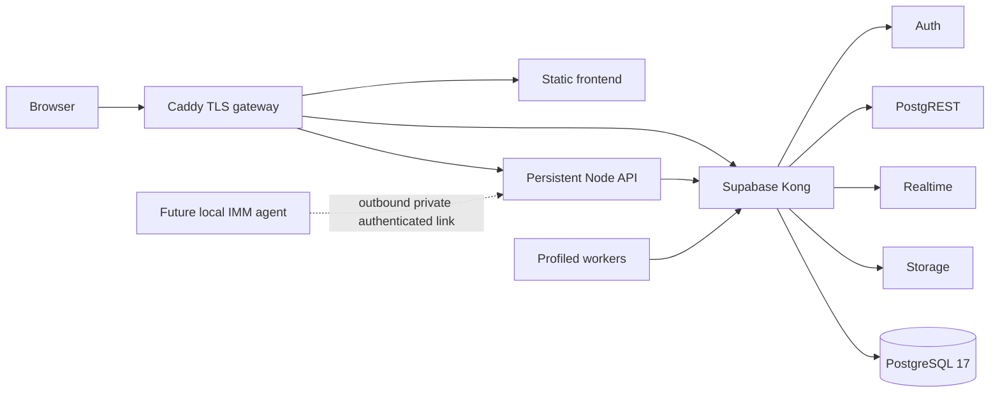

# Black Cloud Architecture

Black Cloud is a compatibility-first, Docker-only replacement for Vercel Functions and hosted Supabase. The source revision for the first migration rehearsal is `21dfd6814b6e92a949ed9a7a0a422faa5d53605d`.

The default application profile contains Caddy, frontend and the central API. The `analytics` profile contains Event Alpha, market depth and BCLIF. The `live-execution` profile is separate and remains stopped until a dedicated execution certificate and explicit cutover approval exist.

Networks:

- `black-cloud-edge`: Caddy and frontend traffic.
- `black-cloud-backplane`: internal API/Supabase traffic; internal Docker network.
- `black-cloud-data`: Supabase database services; internal Docker network.
- `black-cloud-egress`: narrowly scoped outbound provider access for API/workers.

Persistent volumes hold PostgreSQL data, Supabase Storage objects, Caddy state, monitoring state and BCLIF spool data. A single VPS remains a single host failure domain and is not high availability.

The browser uses same-origin `/auth/v1`, `/rest/v1`, `/realtime/v1`, `/storage/v1` and `/api` routes. No production fallback to Vercel or hosted Supabase is configured.
